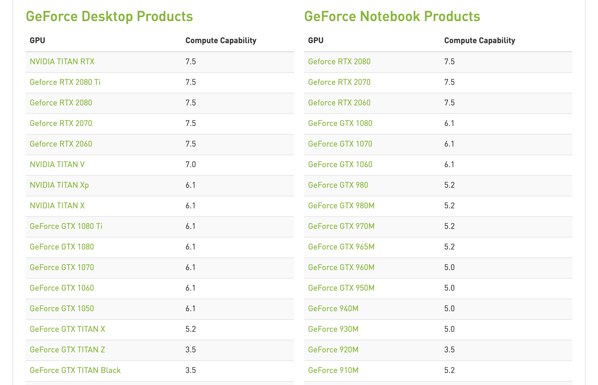
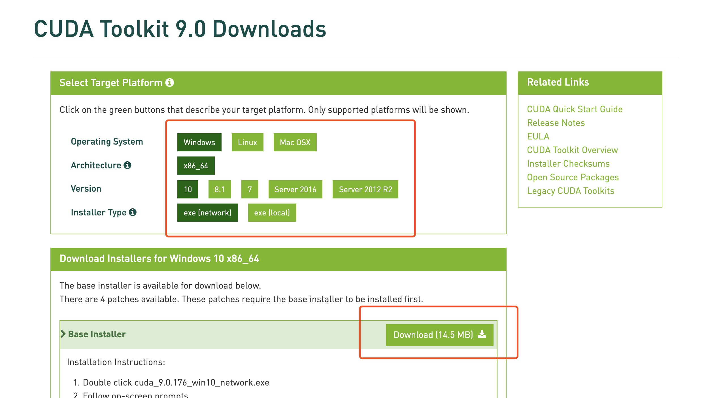
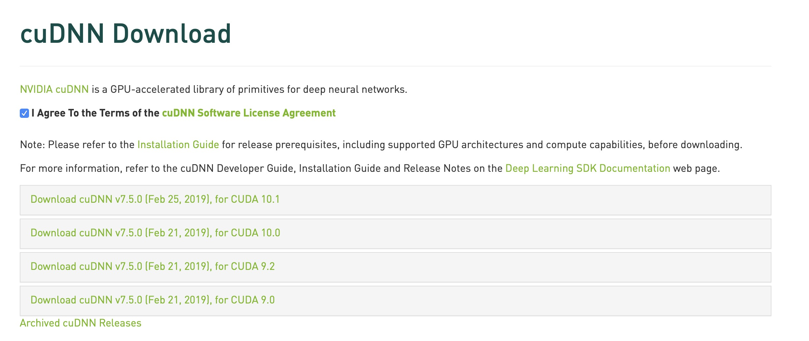

# Windows系统下使用Anaconda配置tensorflow-gpu环境

## 安装Anaconda

1. 下载安装器

   [官方下载链接](https://www.anaconda.com/distribution/#download-section)

   

2. 按步骤安装即可，安装路径可以选在非系统盘，应该会自动配置环境变量，安装完以后可以命令行输入`conda list`测试

## 安装CUDA

1. 检查显卡及驱动版本：命令行进入目录`Program Files\Nvidia Corporation\NVSMI`，执行`nvidia-smi`。或直接进入`设备管理器>显示适配器`查看显卡及驱动。

2. 检查[显卡运算能力及cuda套件支持情况](https://developer.nvidia.com/cuda-gpus)，tensorflow-gpu支持运算能力3.5以上的GPU

   

3. 下载CUDA安装器，此处选择的是9.0版本

   [官方各版本下载列表](https://developer.nvidia.com/cuda-toolkit-archive)

   [9.0版本下载地址](https://developer.nvidia.com/cuda-90-download-archive?target_os=Windows&target_arch=x86_64&target_version=10&target_type=exenetwork)

   

4. 安装CUDA：

   1. 下载完成后直接运行installer即可
   2. 选择自定义安装，建议取消掉安装VS套件，建议更新对应版本的显卡驱动
   3. 若下载时选择网络安装版本，则全程需要联网，不需要梯子

5. 下载cuDNN：[下载地址](https://developer.nvidia.com/rdp/cudnn-download)，需要注册账号登录，注意选择与CUDA版本匹配的cuDNN

   

6. cuDNN解压后，将其内容复制到`Program Files\Nvidia GPU Computing Toolkit\CUDA\v9.0`目录下

## 配置虚拟环境

1. 先用Anaconda创建一个新的虚拟环境（此处命名为tensorflow，并指定python版本为3.6）

   ```
   conda create -n tensorflow python=3.6
   ```

2. 进入虚拟环境

   ```
   activate tensorflow
   ```

3. 安装Anaconda基础运算包

   ```
   conda install anaconda
   ```

4. 安装Tensorflow-GPU（此处指定1.8版本）

   ```
   conda install tensorflow-gpu=1.8
   ```

## 使用虚拟环境

命令行执行python文件之前，先切换环境`activate tensorflow`

